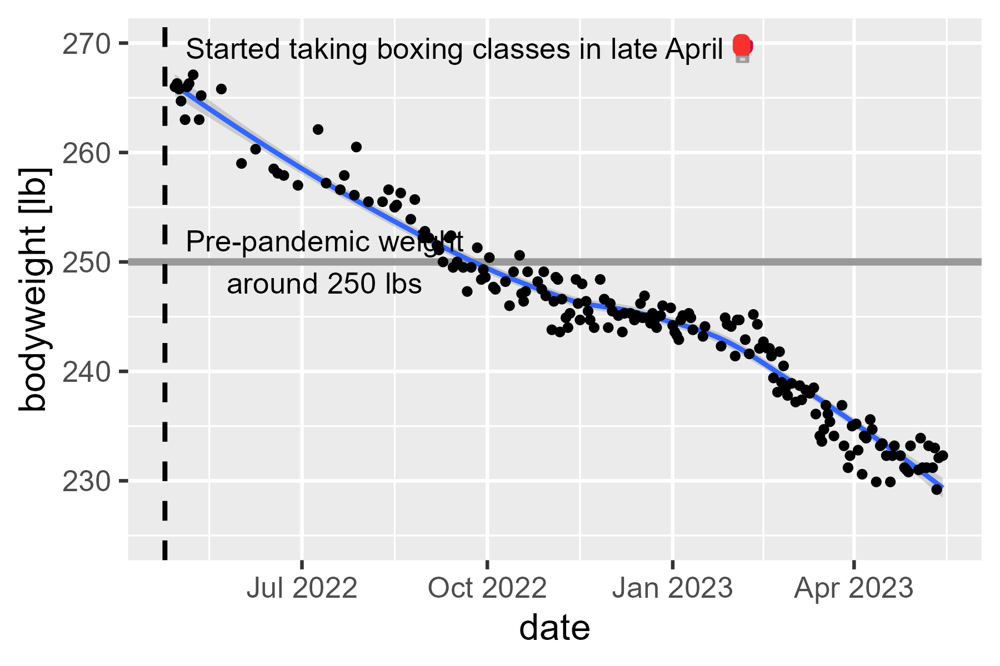

<!-- README.md is generated from README.Rmd. Please edit that file -->

# fitness

<!-- badges: start -->
<!-- badges: end -->

A dumping ground for some of my fitness data.

## exercise-minutes

I exported all of my Apple Health data. The export process provides a
.zip file. I opened the `export.xml` file in the .zip archive and
extracted my daily exercise minutes (the green ring) activity using the
following:

``` r
library(tidyverse)

# Get all nodes in the document with summary
nodes_summary <- xml2::read_xml("C:/Users/trist/Desktop/export.xml") |> 
  xml2::xml_find_all(".//ActivitySummary") 

# Get the attributes in each node and create a dataframe from them
nodes_summary |> 
  xml2::xml_attrs() |>
  lapply(as.list) |> 
  lapply(as.data.frame) |> 
  bind_rows() |> 
  as_tibble() |> 
  # I got my first Apple Watch around Christmas 2018
  filter(dateComponents > "2018-12-19") |> 
  select(
    date = dateComponents,
    exercise_minutes = appleExerciseTime
  ) |> 
  type_convert(
    col_types = cols(
      date = col_date(format = ""),
      exercise_minutes = col_double(),
    )
  ) |>
  write_csv("data/exercise-minutes.csv")
```

Now, I have my exercise minutes for each day.

I should disclose that I turn on an Apple workout on my watch when I mow
the lawn, shovel snow, or do something mildly active like going for a
walk with my family.

``` r
library(tidyverse)

data_minutes <- "data/exercise-minutes.csv" |> 
  # I added entries with Excel and it mangled the dates
  read_csv(
    col_types = cols(
      date = col_date("%m/%d/%Y"), 
      exercise_minutes = "i")
  ) |> 
  # in case i want to aggregate by months within years
  mutate(
    year = lubridate::year(date),
    month = lubridate::month(date),
    year_month = paste0(year, month)
  ) |> 
  group_by(year_month) |> 
  mutate(
    year_month_start = min(date)
  ) |> 
  ungroup()

ggplot(data_minutes |> filter(year > 2018)) + 
  aes(x = date, y = exercise_minutes) + 
  geom_hline(
    yintercept = 30, 
    color = "#92E82A", 
    size = 1, 
  ) +
  geom_point(
    data = function(x) filter(x, exercise_minutes < 125),
    alpha = .4
  ) +
  geom_point(
    aes(y = 125),
    data = function(x) filter(x, exercise_minutes >= 125),
    alpha = .4,
    color = "orange"
  ) +
  facet_wrap("year", scales = "free_x") + 
  stat_smooth(method = "loess", formula = y ~ x) +
  scale_x_date(date_labels = "%b") +
  scale_y_continuous(breaks = c(0, 30, 60, 90, 120)) +
  labs(
    x = "month",
    y = "exercise activity minutes ⌚",
    caption = "Outliers (125+ minutes) replaced with orange points."
  ) +
  theme_light(base_size = 16)
```

<!-- -->

What is my exercise debt (unmet goal minutes)?

``` r
data_minutes |> 
  group_by(year) |> 
  summarise(
    n_days = n(),
    mean_exercise = mean(exercise_minutes),
    exercise = sum(exercise_minutes),
    debt = sum(30 - exercise_minutes)
  )
#> # A tibble: 5 × 5
#>    year n_days mean_exercise exercise  debt
#>   <dbl>  <int>         <dbl>    <int> <dbl>
#> 1  2018     12          24        288    72
#> 2  2019    365          28.7    10461   489
#> 3  2020    366          23.0     8421  2559
#> 4  2021    365          23.8     8698  2252
#> 5  2022    290          44.5    12894 -4194

data_minutes |> 
  summarise(
    n_days = n(),
    mean_exercise = mean(exercise_minutes),
    exercise = sum(exercise_minutes),
    debt = sum(30 - exercise_minutes)
  )
#> # A tibble: 1 × 4
#>   n_days mean_exercise exercise  debt
#>    <int>         <dbl>    <int> <dbl>
#> 1   1398          29.2    40762  1178
```

My stupid Apple Fitness said my September 2022 challenge is 64 minutes
of exercise activity per day on average, so let’s make a query to check
on that.

``` r
data_minutes |> 
  filter(year == 2022) |> 
  group_by(year, month) |> 
  summarise(
    num_days = n(),
    sum_minutes = sum(exercise_minutes),
    mean_minutes = scales::label_number(.1)(mean(exercise_minutes)),
    prop_of_sept_22_goal = (sum(exercise_minutes) / (64 * 30)) |> round(2),
    .groups = "drop"
  ) |> 
  ungroup() |> 
  arrange(desc(year), desc(month)) |> 
  knitr::kable(align = "lrrrr")
```

| year | month | num_days | sum_minutes | mean_minutes | prop_of_sept_22_goal |
|:-----|------:|---------:|------------:|-------------:|:---------------------|
| 2022 |    10 |       17 |        1400 |         82.4 | 0.73                 |
| 2022 |     9 |       30 |        2248 |         74.9 | 1.17                 |
| 2022 |     8 |       31 |        2251 |         72.6 | 1.17                 |
| 2022 |     7 |       31 |        1616 |         52.1 | 0.84                 |
| 2022 |     6 |       30 |        1548 |         51.6 | 0.81                 |
| 2022 |     5 |       31 |        1194 |         38.5 | 0.62                 |
| 2022 |     4 |       30 |         804 |         26.8 | 0.42                 |
| 2022 |     3 |       31 |         710 |         22.9 | 0.37                 |
| 2022 |     2 |       28 |         571 |         20.4 | 0.30                 |
| 2022 |     1 |       31 |         552 |         17.8 | 0.29                 |

## fast miles

In September 2022, I started jogging my kid to preschool in a running
stroller. School is just a little more than a mile away. After a few
weeks, I decided to compete with myself for how fast I could run the
first mile split on these jogs.

``` r
convert_min_sec_to_sec <- function(xs) {
  # ye olde splitten applyen combinen
  xs |> 
    strsplit(split = ":", fixed = TRUE) |> 
    lapply(function(x) {
      x <- as.numeric(x)
      60 * x[1] + x[2]
    }) |> 
    unlist(use.names = FALSE)
}

data_miles <- "data/miles-to-school.csv" |> 
  # I added entries with Excel and it mangled the dates
  read_csv(
    col_types = cols(
      date = col_date("%m/%d/%Y"), 
      first_mile_split = "c",
      comment = "c",
    )
  ) |> 
  mutate(
    time = convert_min_sec_to_sec(first_mile_split)
  )

ggplot(data_miles) + 
  aes(x = date, y = time) +
  geom_point(size = 3) +
  scale_y_continuous(
    breaks = (14:22 / 2) * 60,
    labels = function(x) {
      sprintf("%02d:%02d", x %/% 60, x %% 60)
    }
  ) +
  labs(
    x = "date", 
    y = "pace [min per mi]"
  ) +
  theme_light(base_size = 16)
```

<!-- -->

## intervals

-   Run some distance as fast as you can (time it), stop and recover
    until heartrate is 140 bpm (time how long the recovery takes).
-   Do this for the following distances (m): 800, 800, 600, 600, 400,
    400, 200.

I injured my knee doing the 200 m sprint on 2022-09-06 and now I’m kind
of scared of this workout.

``` r
library(tidyverse)
d <- "data/intervals.csv" |> 
  read_csv(
    col_types = cols(
      interval_number = "i",
      time = "c",
      distance = "c",
      date = col_date("%m/%d/%Y")
    )
  ) |> 
  mutate(
    time = convert_min_sec_to_sec(time)
  )

d_date_margins <- d |> 
  group_by(date, interval_type) |> 
  summarise(
    intervals = n(),
    total_time = sum(time),
    distance = sum(as.numeric(distance)),
    .groups = "drop"
  )
d_date_margins
#> # A tibble: 12 × 5
#>    date       interval_type intervals total_time distance
#>    <date>     <chr>             <int>      <dbl>    <dbl>
#>  1 2022-07-28 recover               7        778     3800
#>  2 2022-07-28 run                   7       1232     3800
#>  3 2022-08-16 recover               7       1231     3800
#>  4 2022-08-16 run                   7       1181     3800
#>  5 2022-08-19 recover               7        794     3800
#>  6 2022-08-19 run                   7       1166     3800
#>  7 2022-08-25 recover               7        904     3800
#>  8 2022-08-25 run                   7       1156     3800
#>  9 2022-08-30 recover               7       1003     3800
#> 10 2022-08-30 run                   7       1095     3800
#> 11 2022-09-06 recover               7        823     3800
#> 12 2022-09-06 run                   7       1162     3800

d |> 
  filter(interval_type == "run") |> 
  ggplot() + 
    aes(
      x = (interval_number + 1) / 2, 
      y = (time / 60) / (as.numeric(distance) / 1000)
    ) +
    geom_line(aes(group = date, color = factor(date))) +
    geom_point(aes(color = factor(date))) +
    geom_label(
      aes(
        label = paste0(distance, " m"), 
        y = 3.5
      ), 
      hjust = .5,
      stat = "unique"
    ) +
    geom_label(
      aes(label = label, y = 3.5),
      data = data.frame(interval_number = 15, label = "(all)"),
      hjust = .5,
    ) +
    geom_point(
      aes(color = factor(date)), 
      data = d_date_margins |> 
        filter(interval_type == "run") |> 
        mutate(interval_number = 15) |> 
        rename(time = total_time),
    ) +
    labs(
      x = "running interval number", 
      y = "pace [min per km] (lower: better)", 
      color = "date"
    )
```

<!-- -->

``` r

d |> 
  filter(interval_type == "run") |> 
  ggplot() + 
    aes(
      x = (interval_number + 1) / 2, 
      y = (time) / (as.numeric(distance) / 200)
    ) +
    geom_line(aes(group = date, color = factor(date))) +
    geom_point(aes(color = factor(date))) +
    geom_label(
      aes(
        label = paste0(distance, " m"), 
        y = 30
      ), 
      hjust = .5,
      stat = "unique"
    ) +
    geom_label(
      aes(label = label, y = 30),
      data = data.frame(interval_number = 15, label = "(all)"),
      hjust = .5,
    ) +
    geom_point(
      aes(color = factor(date)), 
      data = d_date_margins |> 
        filter(interval_type == "run") |> 
        mutate(interval_number = 15) |> 
        rename(time = total_time),
    ) +
    labs(
      x = "running interval number", 
      y = "seconds per 200 m (lower: better)", 
      color = "date"
    )
```

<!-- -->

``` r

d |> 
  filter(interval_type == "recover") |> 
  ggplot() + 
    aes(
      x = (interval_number + 1) / 2, 
      y = time
    ) +
    geom_line(aes(group = date, color = factor(date))) +
    geom_point(aes(color = factor(date))) +
    geom_label(
      aes(
        label = paste0(distance, " m"), 
        y = 45
      ), 
      hjust = .5,
      stat = "unique"
    ) +
    labs(
      x = "running interval number", 
      y = "recovery duration [s] (lower: better)", 
      color = "date",
      caption = "I used a different workout app on 2022-08-16 🤷‍♀️"
    )
```

<!-- -->

## bodyweight

In April, I took up a new hobby: Weekly boxing classes. This new
activity motivated me to be a little more active (closing my watch’s
daily exercise goal more often or trying exercises that help for boxing
conditioning). I started measuring my bodyweight around this time. I
haven’t change my diet or anything like that, and I don’t have any
weight goals besides getting back to my pre-pandemic bodyweight (250
lbs).

``` r
data_weight <- "data/bodyweight.csv" |> 
  read_csv(col_types = cols(date = col_date("%m/%d/%Y"))) 

p <- data_weight |> 
  ggplot() + 
  aes(x = date, y = weight) + 
  stat_smooth(method = "loess", formula = y ~ x) +
  geom_point() +
  ylim(245, 270) + 
  labs(y = "bodyweight [lb]") +
  theme_grey(base_size = 16) +
  theme(
    panel.grid.minor.y = element_blank()
  )

p
```

<!-- -->

``` r

library(ggrepel)

data_weight |> 
  ggplot() + 
  aes(x = date, y = weight) + 
  geom_hline(
    yintercept = 250,
    # linetype = "dashed",
    size = 1.5,
    color = "grey60"
  ) +
  geom_vline(
    linetype = "dashed",
    xintercept = as.Date("2022-04-24"),
    size = 1,
  ) +
  stat_smooth(method = "loess", formula = y ~ x) +
  geom_point() +
  ylim(245, 270) + 
  labs(y = "bodyweight [lb]") +
  theme_grey(base_size = 16) +
  theme(
    panel.grid.minor.y = element_blank()
  ) +

  geom_text_repel(
    data = data.frame(
      date = as.Date("2022-04-25"),
      weight = 269
    ),
    nudge_y = .5,
    point.padding = 0.2,
    segment.curvature = 1e-20,
    xlim = c(as.Date("2022-04-30"), NA),
    label = "Started taking boxing classes in late April 🥊",
    size = 4.5
  ) +
  geom_text_repel(
    data = data.frame(
      date = as.Date("2022-04-26"),
      weight = 250
    ),
    nudge_y = 1,
    point.padding = 0.5,
    segment.curvature = 1e-20,
    xlim = c(as.Date("2022-04-30"), NA),
    label = "Pre-pandemic weight was around 250 lbs",
    size = 4.5
  )  + 
  geom_blank(
    aes(x = max(c(data_minutes$date, data_weight$date)), y = 260),
  )
```

<!-- -->

The last time I was on a months-long fitness kick, I did a Nike+ Run
Club training program for a half-marathon. In a one-month period (July
2015), I ran a half-marathon distance three times. My weight at that
time was 234 lbs, so that’s the benchmark for Tristan, The Cardio
Machine.
