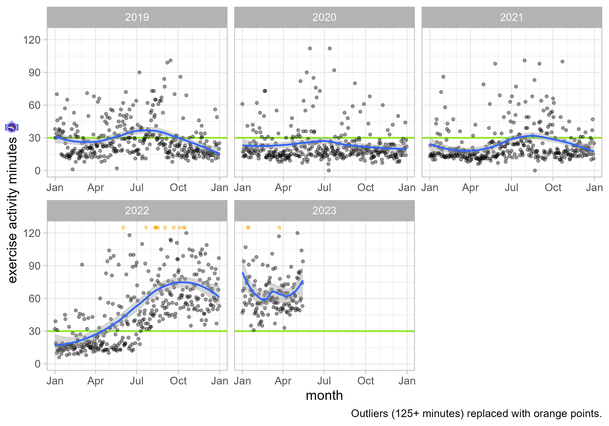
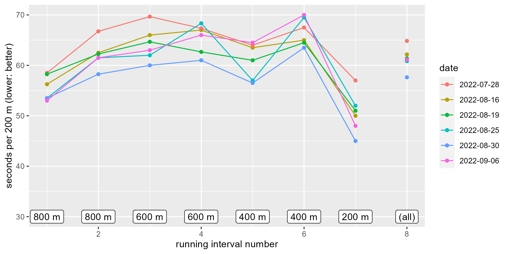
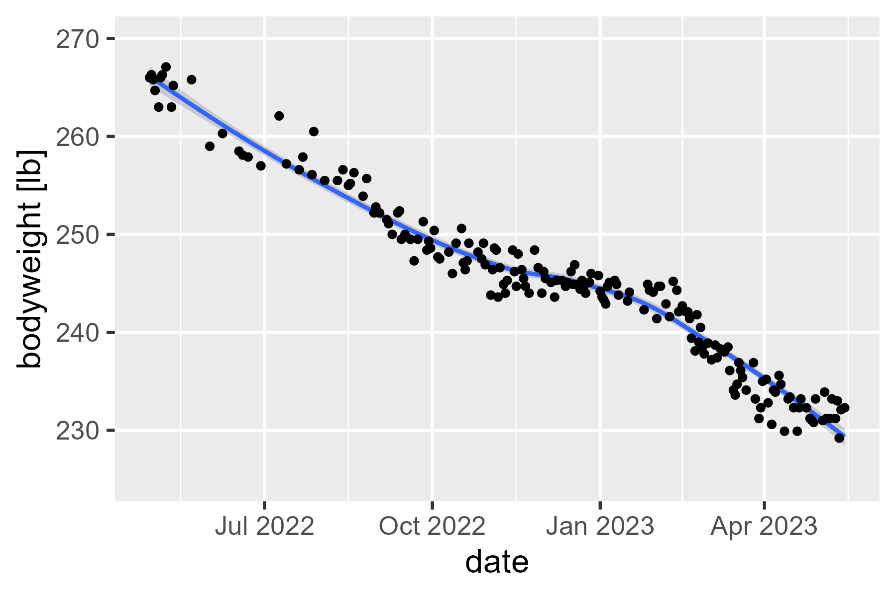

<!-- README.md is generated from README.Rmd. Please edit that file -->

# fitness

<!-- badges: start -->
<!-- badges: end -->

A dumping ground for some of my fitness data.

## exercise-minutes

I exported all of my Apple Health data. The export process provides a
.zip file. I opened the `export.xml` file in the .zip archive and
extracted my daily exercise minutes (the green ring) activity using the
following:

``` r
library(tidyverse)

# Get all nodes in the document with summary
nodes_summary <- xml2::read_xml("C:/Users/trist/Desktop/export.xml") |> 
  xml2::xml_find_all(".//ActivitySummary") 

# Get the attributes in each node and create a dataframe from them
nodes_summary |> 
  xml2::xml_attrs() |>
  lapply(as.list) |> 
  lapply(as.data.frame) |> 
  bind_rows() |> 
  as_tibble() |> 
  # I got my first Apple Watch around Christmas 2018
  filter(dateComponents > "2018-12-19") |> 
  select(
    date = dateComponents,
    exercise_minutes = appleExerciseTime
  ) |> 
  type_convert(
    col_types = cols(
      date = col_date(format = ""),
      exercise_minutes = col_double(),
    )
  ) |>
  write_csv("data/exercise-minutes.csv")
```

Now, I have my exercise minutes for each day.

``` r
library(tidyverse)

data_minutes <- "data/exercise-minutes.csv" |> 
  # I added entries with Excel and it mangled the dates
  read_csv(
    col_types = cols(
      date = col_date("%m/%d/%Y"), 
      exercise_minutes = "i")
  ) |> 
  # in case i want to aggregate by months within years
  mutate(
    year = lubridate::year(date),
    month = lubridate::month(date),
    year_month = paste0(year, month)
  ) |> 
  group_by(year_month) |> 
  mutate(
    year_month_start = min(date)
  ) |> 
  ungroup()

ggplot(data_minutes |> filter(year > 2018)) + 
  aes(x = date, y = exercise_minutes) + 
  geom_hline(
    yintercept = 30, 
    color = "darkgreen", 
    size = 1, 
    linetype = "dashed"
  ) +
  geom_point(alpha = .4) +
  facet_wrap("year", scales = "free") + 
  stat_smooth(method = "loess", formula = y ~ x)
```

<!-- -->

What is my exercise debt (unmet goal minutes)?

``` r
data_minutes |> 
  group_by(year) |> 
  summarise(
    n_days = n(),
    mean_exercise = mean(exercise_minutes),
    exercise = sum(exercise_minutes),
    debt = sum(30 - exercise_minutes)
  )
#> # A tibble: 5 × 5
#>    year n_days mean_exercise exercise  debt
#>   <dbl>  <int>         <dbl>    <int> <dbl>
#> 1  2018     12          24        288    72
#> 2  2019    365          28.7    10461   489
#> 3  2020    366          23.0     8421  2559
#> 4  2021    365          23.8     8698  2252
#> 5  2022    230          36.4     8381 -1481

data_minutes |> 
  summarise(
    n_days = n(),
    mean_exercise = mean(exercise_minutes),
    exercise = sum(exercise_minutes),
    debt = sum(30 - exercise_minutes)
  )
#> # A tibble: 1 × 4
#>   n_days mean_exercise exercise  debt
#>    <int>         <dbl>    <int> <dbl>
#> 1   1338          27.1    36249  3891
```

## intervals

-   Run some distance as fast as you can (time it), stop and recover
    until heartrate is 140 bpm.
-   Do this for the following distances (m): 800, 800, 600, 600, 400,
    400, 200.

``` r
library(tidyverse)

convert_min_sec_to_sec <- function(xs) {
  # ye olde splitten applyen combinen
  xs |> 
    strsplit(split = ":", fixed = TRUE) |> 
    lapply(function(x) {
      x <- as.numeric(x)
      60 * x[1] + x[2]
    }) |> 
    unlist(use.names = FALSE)
}

d <- "data/intervals.csv" |> 
  read_csv(
    col_types = cols(
      interval_number = "i",
      time = "c",
      distance = "c",
      date = col_date("%m/%d/%Y")
    )
  ) |> 
  mutate(
    time = convert_min_sec_to_sec(time)
  )

d |> 
  # Include all distances aggregated together as "[all]"
  bind_rows(d |> mutate(distance = "[all]")) |> 
  filter(interval_type == "run") |> 
  group_by(date, distance) |> 
  summarise(
    intervals = n(),
    total_run_time = sum(time),
    .groups = "drop"
  )
#> # A tibble: 15 × 4
#>    date       distance intervals total_run_time
#>    <date>     <chr>        <int>          <dbl>
#>  1 2022-07-28 [all]            7           1232
#>  2 2022-07-28 200              1             57
#>  3 2022-07-28 400              2            263
#>  4 2022-07-28 600              2            411
#>  5 2022-07-28 800              2            501
#>  6 2022-08-16 [all]            7           1181
#>  7 2022-08-16 200              1             50
#>  8 2022-08-16 400              2            257
#>  9 2022-08-16 600              2            399
#> 10 2022-08-16 800              2            475
#> 11 2022-08-19 [all]            7           1166
#> 12 2022-08-19 200              1             51
#> 13 2022-08-19 400              2            251
#> 14 2022-08-19 600              2            382
#> 15 2022-08-19 800              2            482

d_date_margins <- d |> 
  group_by(date, interval_type) |> 
  summarise(
    intervals = n(),
    total_time = sum(time),
    distance = sum(as.numeric(distance)),
    .groups = "drop"
  )
d_date_margins
#> # A tibble: 6 × 5
#>   date       interval_type intervals total_time distance
#>   <date>     <chr>             <int>      <dbl>    <dbl>
#> 1 2022-07-28 recover               7        778     3800
#> 2 2022-07-28 run                   7       1232     3800
#> 3 2022-08-16 recover               7       1231     3800
#> 4 2022-08-16 run                   7       1181     3800
#> 5 2022-08-19 recover               7        794     3800
#> 6 2022-08-19 run                   7       1166     3800

d |> 
  filter(interval_type == "run") |> 
  ggplot() + 
    aes(
      x = (interval_number + 1) / 2, 
      y = (time / 60) / (as.numeric(distance) / 1000)
    ) +
    geom_line(aes(group = date, color = factor(date))) +
    geom_point(aes(color = factor(date))) +
    geom_label(
      aes(
        label = paste0(distance, " m"), 
        y = 3.5
      ), 
      hjust = .5,
      stat = "unique"
    ) +
    geom_label(
      aes(label = label, y = 3.5),
      data = data.frame(interval_number = 15, label = "(all)"),
      hjust = .5,
    ) +
    geom_point(
      aes(color = factor(date)), 
      data = d_date_margins |> 
        filter(interval_type == "run") |> 
        mutate(interval_number = 15) |> 
        rename(time = total_time),
    ) +
    labs(
      x = "running interval number", 
      y = "pace [min per km] (lower: better)", 
      color = "date"
    )
```

<!-- -->

``` r

d |> 
  filter(interval_type == "recover") |> 
  ggplot() + 
    aes(
      x = (interval_number + 1) / 2, 
      y = time
    ) +
    geom_line(aes(group = date, color = factor(date))) +
    geom_point(aes(color = factor(date))) +
    geom_label(
      aes(
        label = paste0(distance, " m"), 
        y = 45
      ), 
      hjust = .5,
      stat = "unique"
    ) +
    labs(
      x = "running interval number", 
      y = "recovery duration [s] (lower: better)", 
      color = "date",
      caption = "I used a different workout app on 2022-08-16 🤷‍♀️"
    )
```

<!-- -->

## bodyweight

In April, I took up a new hobby: Weekly boxing classes. This new
activity motivated me to be a little more active (closing my watch’s
daily exercise goal more often or trying exercises that help for boxing
conditioning). I started measuring my bodyweight around this time. I
haven’t change my diet or anything like that, and I don’t have any
weight goals besides getting back to my pre-pandemic bodyweight (250
lbs).

``` r
"data/bodyweight.csv" |> 
  read_csv(col_types = cols(date = col_date("%m/%d/%Y"))) |> 
  ggplot() + 
  aes(x = date, y = weight) + 
  ylim(250, 270) + 
  stat_smooth(method = "loess", formula = y ~ x) +
  geom_point() +
  theme_grey(base_size = 16) +
  labs(y = "bodyweight [lb]")
```

<!-- -->
